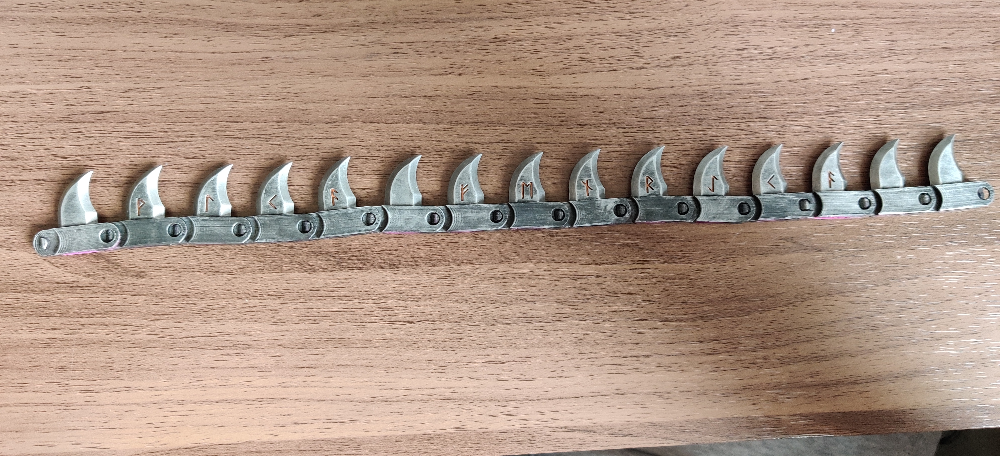
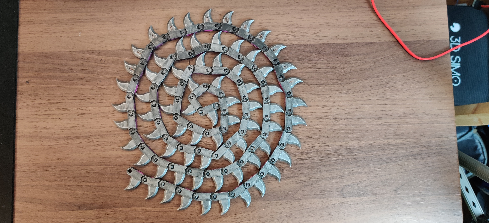
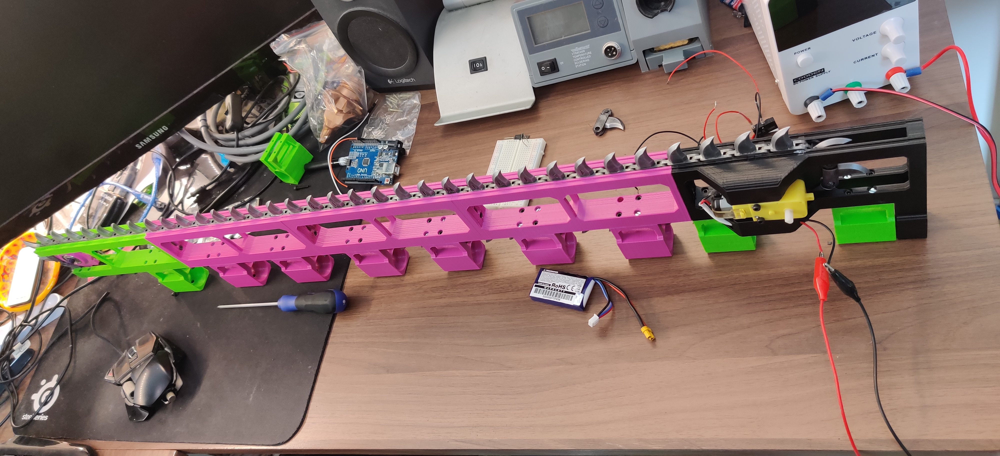
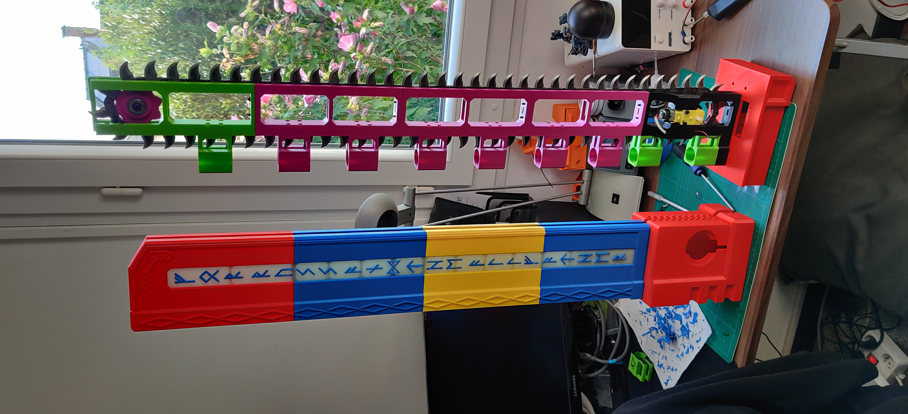
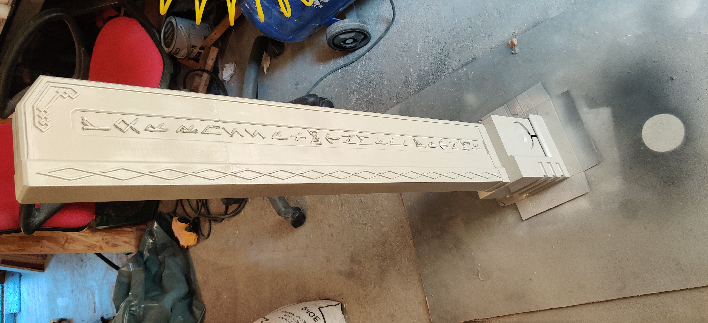
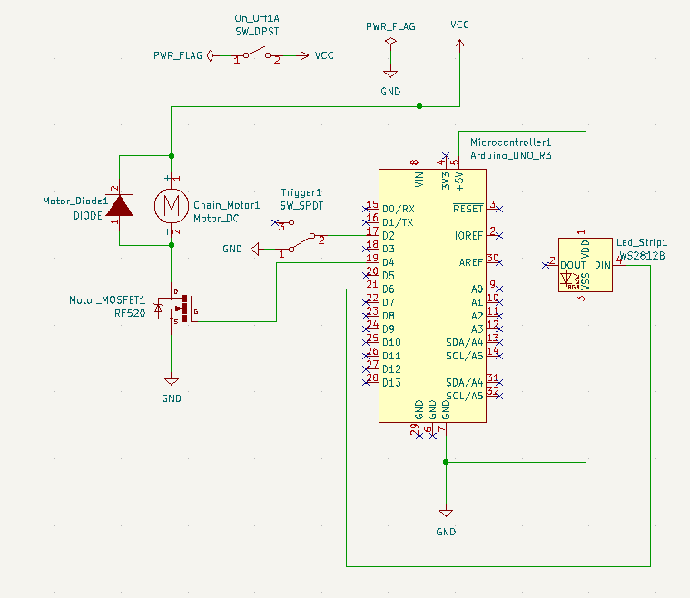
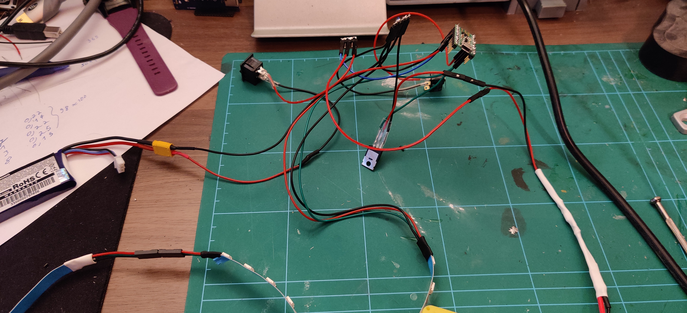

# ChainSword

This project provides the code for a functionnal, 3D printed, chainsword using a microcontroller, a dc motor & a neopixel strip led.
 
The source code is a PlatformIO project, to build it you should open it in an IDE supporting PlatformIO. 
The project is configured to use a A-Star 32U4 Micro microcontroller.

The 3d models can be found [here](https://cults3d.com/fr/modèle-3d/jeu/space-wolves-chainsword).

# Building the chainsword
## Parts

### 3D Printed Parts
To print the chainsword, I used the following parameters.

#### PLA 0.2mm
- Intermediate_Structure.stl x3 
- Bottom_Structure.stl x1
- Top_Structure x1
- Broom_Holder.stl x10
- Cross_Guard.stl x1
- Cross_Guard_Hatch.stl x1
- Guard.stl x1
- Handle.stl x1
- Base_Blade_Cover.stl x1
- Blade_Cover_First_Section.stl x1
- Blade_Cover_Second_Section.stl x1
- Blade_Cover_Third_Section.stl x1
- Blade_Cover_Head.stl x1
- Tooth_Base.stl x75

#### PLA 0.1mm
- Top_Structure_Gear_Rail.stl x1
- Top_Structure_End.stl x1
- Top_Gear_Wheel.stl x1
- Motorized_Gear_Wheel.stl x1
- Motorized_Gear_Wheel_Axis.stl x1
- Trigger.stl x1
- Trigger_Axis.stl x1
- Display_Gear_Wheel_Cover.stl x1
- Motor_Axis_Opening_Cover.stl x1
- Base_Blade_Cover_Teeth_Opening_Cover.stl x1

#### Phosphorescent PLA 0.1mm you could print these parts in normal PLA if you don't want to add leds in the blasde
- Blade_Cover_Head_Rune_Front.stl x1
- Blade_Cover_Head_Rune_Back.stl x1
- Blade_Cover_Third_Section_Front.stl x1
- Blade_Cover_Third_Section_Back.stl x1
- Blade_Cover_Second_Section_Front.stl x1
- Blade_Cover_Second_Section_Back.stl x1
- Blade_Cover_First_Section_Front.stl x1
- Blade_Cover_First_Section_Back.stl x1

#### Resin 0.05mm
- Display_Gear_Wheel.stl x1
- Tooth_Basic_Top.stl x64
- Tooth_V_Top.stl x1
- Tooth_L_Top.stl x1
- Tooth_K_Top.stl x2
- Tooth_A_Top.stl x2
- Tooth_F_Top.stl x1
- Tooth_E_Top.stl x1
- Tooth_N_Top.stl x1
- Tooth_R_Top.stl x1
- Tooth_Y_Top.stl x1
- Pommel x1

### Hardware
You will also need the some hardware.

#### Screws
- M2x8 x4
- M2x12 x2
- M2x16 Screw x2
- M3x8 x7
- M3x12 x10
- M3x16 x40
- M3x20 x4
- M3x25 x2
- M3x30+ x1
- 3x20 wood screw x12

#### Nuts
- M2 x2
- M3 x55

#### Threaded Insert for plastic
- M3x10x5 x9
- M2x4x3.5 x6

### Other
- Broom stick, around 120 cm, 25 mm diameter x1
- 608-zz ABEC bearing x2
- ~6x40mm spring x1
- ~7-20mm spring x1
- Lubricant / Grease
- Masking Tape

### Electronics
- GearMotor DG01D x1
- microswitch SS-5GL x1
- Pololu A-Star 32U4 Micro microcontroller x1
- WS2812B Led Strip x1 (at least 18 Leds)
- On/Off Switch x1
- Type N Mosfet (i.e. IRF520) x1
- diode x1
- Battery 7.4v 500mah

### Tools
- M3 Hex Screwdriver
- M2 Hex Screwdriver
- Phillips Screwdriver
- Soldering Iron
- Cyanoacrylate Glue
- Plastic Glue
- Filler Primer
- Paint
- Sand paper
- Hot Glue Gun

## Chainsword assembly
Lets start the assembly of the chainsword. Each step will presents the needed parts first then the sub-steps.
### Chain
- Tooth_Base.stl x75
- Tooth_Basic_Top.stl x64
- Tooth_V_Top.stl x1
- Tooth_L_Top.stl x1
- Tooth_K_Top.stl x2
- Tooth_A_Top.stl x2
- Tooth_F_Top.stl x1
- Tooth_E_Top.stl x1
- Tooth_N_Top.stl x1
- Tooth_R_Top.stl x1
- Tooth_Y_Top.stl x1

1. Glue each **Top** on each **Tooth_Base** with Cyanoacrylate Glue.
2. Paint the teeth.
3. Clip the teeth with letters to form the text **VLKA FENRYKA** separed by one normal tooth. 
4. Clip the already formed chain and all the remaining teeth to form the final chain. Don't close it yet, keep one link open. 

### Cross Guard
- Cross_Guard.stl x1
- Trigger.stl x1
- Trigger_Axis.stl x1
- microswitch SS-5GL x1
- On/Off Switch x1
- M2x4x3.5 Threaded Insert x4
- M2x16 Screw x2
- M2 Nut x2
- ~7-20mm spring x1

1. Solder electrical wire to the **microswitch** and the **On/Off Switch**.
2. Use filler primer on the **Cross_Guard** and **Trigger** parts, sand them and finally paint them.
3. Use a soldering iron to put the **inserts** on the appropriate holes on the **Cross_Guard** part.
4. Screw the **microswitch** to the **Cross_Guard** with the **M2x16** Screws and the **M2 Nuts**.
5. Fix the **Trigger** to the **Cross_Guard** with the **Trigger_Axis**.
6. Put the **Spring** between the **Trigger** and the **Cross_Guard**.
7. Insert the **On/Off Switch** in the remaining location.

### Structure
- Intermediate_Structure.stl x3
- Bottom_Structure.stl x1
- Top_Structure x1
- Broom_Holder.stl x10
- Cross_Guard.stl x1
- Broom stick, around 120 cm, 25 mm diameter x1
- WS2812B Led Strip x1 (at least 18 Leds)
- M3x16 x40
- M3x12 x10
- M3 Nuts x50

1. Screw the **Cross_Guard** with the **Bottom_Structure** part using **2 M3x12** and **2 M3 Nuts**.
2. Screw the **3 Intermediate_Structure** parts together and with the **Bottom_Structure** using **6 M3x12** and **6 M3 Nuts**.
3. Screw the **Top_Structure** part with the result of the previous step using **2 M3x12** and **2 M3 Nuts**.
4. Screw the **Broom_Holder** parts to the **structure** using **40 M3x16** and **40 M3 Nuts**.
5. Insert the **Broom Stick** into the holes along the **structure**.
6. Glue the **Led Strip** on the **structure** with the hot glue gun.

### Gears
- GearMotor DG01D x1
- 608-zz ABEC bearing x2
- ~6x40mm spring x1
- Top_Structure_Gear_Rail.stl x1
- Top_Structure_End.stl x1
- Top_Gear_Wheel.stl x1
- Motorized_Gear_Wheel.stl x1
- Motorized_Gear_Wheel_Axis.stl x1
- M3x20 x2
- M3x25 x2
- M3x30 x1
- M3 Nuts x5
- Chain
- Structure

1. Put the **Gear Motor** on the location provided on the **Bottom_Structure** part with **2 M3x25** screw and **2 M3 nuts**.
2. Fix the **Motorized_Gear_Wheel** to the **Gear Motor**.
3. Glue the **Motorized_Gear_Wheel_Axis** to the **Motorized_Gear_Wheel** then put a **608-zz ABEC bearingring** on the location provided on the **Bottom_Structure** in such a way that the **Motorized_Gear_Wheel_Axis** is inside the bearing.
4. Slide the **Top_Structure_Gear_Rail** part on the rail on top of the **Top_Structure** part, insert an **M3 nut** on the location provided for it inside the **Top_Structure_Gear_Rail** part.
5. Insert a **608-zz ABEC bearingring** into the **Top_Gear_Wheel** part, then put the wheel on the axis of **Top_Structure_Gear_Rail**.
6. Insert **2 M3 Nuts** into the holes on the side of the **Top_Structure** part then screw the **Top_Structure_End** with **2 M3x20**.
7. Insert the **M3x30** screw into the hole on the middle of **Top_Structure_End** then put the **Spring** on it befor screwing it to the **Top_Structure_Gear_Rail**.
8. Put **lubricant or grease** on the **chain** and the slots along the **structure**.
9. Put the **chain** on the structure and close it by clipping the last link.
10. Adjust the **chain** tension by tightening or loosening the screw fixed on the **Top_Structure_Gear_Rail**.
11. You can now test if the **chain** rotate correctly manually or by powering the **motor**.

### Handle & Guard
- Structure
- Guard.stl x1
- Handle.stl x1
- M3x20 x2
- M3x10x5 x2
- 3x20 wood screw x2

1. Use filler primer on the **Handle** and **Guard** parts, sand them and finally paint them.
2. Use a soldering iron to put the **inserts** on the appropriate holes on the **Guard** part.
3. Put the **Handle** on the **broom stick** which exceeds from the structure, then screw it with **2 3x20 wood screw**.
4. Put the **Guard** on the **broom stick** and into the hole of the **Cross_Guard** and screw it with **M3x20**.

### Blade Cover
- Base_Blade_Cover.stl x1
- Blade_Cover_First_Section.stl x1
- Blade_Cover_Second_Section.stl x1
- Blade_Cover_Third_Section.stl x1
- Blade_Cover_Head.stl x1
- Blade_Cover_Head_Rune_Front.stl x1
- Blade_Cover_Head_Rune_Back.stl x1
- Blade_Cover_Third_Section_Front.stl x1
- Blade_Cover_Third_Section_Back.stl x1
- Blade_Cover_Second_Section_Front.stl x1
- Blade_Cover_Second_Section_Back.stl x1
- Blade_Cover_First_Section_Front.stl x1
- Blade_Cover_First_Section_Back.stl x1
- M2x4x3.5 insert x2
- M3x10x5 insert x7

1. For each section, insert the corresponding runes part, all front on the same side, and all back on the other side : 
    - **Blade_Cover_First_Section** : **Blade_Cover_First_Section_Front** & **Blade_Cover_First_Section_Back**.
    - **Blade_Cover_Second_Section** : **Blade_Cover_Second_Section_Front** & **Blade_Cover_Second_Section_Back**.
    - **Blade_Cover_Third_Section** : **Blade_Cover_Third_Section_Front** & **Blade_Cover_Third_Section_Back**.
    - **Blade_Cover_Head** : **Blade_Cover_Head_Rune_Front** & **Blade_Cover_Head_Rune_Back**.
2. Use a soldering iron to put the **M3x10x5 Inserts** and the **M2x4x3.5** on the appropriate holes on the **Base_Blade_Cover** part.
3. Slide along the **blade structure**, in that order, the following part : **Base_Blade_Cover.stl**, **Blade_Cover_First_Section.stl**, **Blade_Cover_Second_Section.stl**, **Blade_Cover_Third_Section.stl** and **Blade_Cover_Head.stl**. Glue them togheter with plastic glue or cyanoacrylate. Take the oppotunity to glue the **runes**.
4. Once the glue is dry, remove the **blade cover** from the **structure**. 
5. Put masking tape over the **runes** then prime and paint the **blade cover**. Once the paint is dry, remove the masking tape. 

### Electronics
- GearMotor DG01D x1
- microswitch SS-5GL x1
- Pololu A-Star 32U4 Micro microcontroller x1
- WS2812B Led Strip x1 (at least 18 Leds)
- On/Off Switch x1
- Type N Mosfet (i.e. IRF520) x1
- diode x1
- Battery 7.4v 500mah

Use the following circuit diagram to make the electronics for the project.

### Final parts
- Cross_Guard_Hatch.stl x1
- Display_Gear_Wheel.stl x1
- Display_Gear_Wheel_Cover.stl x1
- Motor_Axis_Opening_Cover.stl x1
- Base_Blade_Cover_Teeth_Opening_Cover.stl x1
- M2x8 x4
- M2x12 x2
- M3x8 x7
- Pommel x1

1. Prime and paint the remaining parts (**Cross_Guard_Hatch.stl**, **Display_Gear_Wheel.stl**, **Display_Gear_Wheel_Cover.stl**, **Motor_Axis_Opening_Cover.stl** and **Base_Blade_Cover_Teeth_Opening_Cover.stl**).
2. Put the **blade cover** over the structure and screw it with the 7 **M3x8 screws**.
3. Put the **Display_Gear_Wheel_Cover.stl** over the motor opening then put the the **Display_Gear_Wheel.stl** on the motor axis.
4. Insert the **Motor_Axis_Opening_Cover.stl** into the **Base_Blade_Cover.stl** location.
5. Screw the **Base_Blade_Cover_Teeth_Opening_Cover.stl** with the **2 M2x12 screws**.
6. Put in place the **Cross_Guard_Hatch.stl** then secure it with **4 M2x8 screws**.
7. Finally, glue the **Pommel** with the hot glue gun. 

You now have a working chainsword. 

Enjoy.