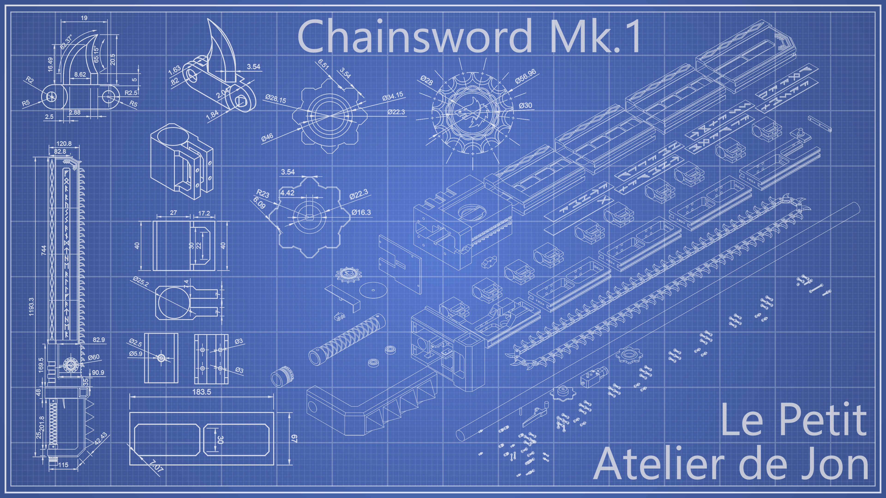
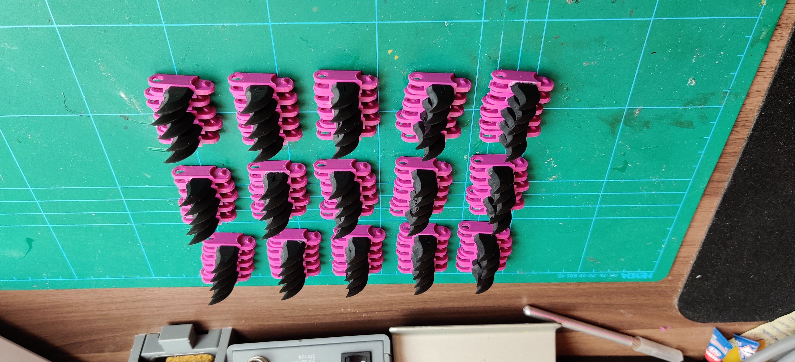
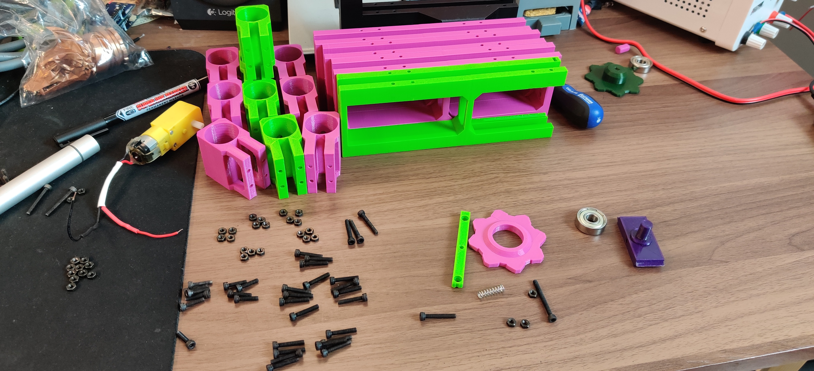

# ChainSword

This page contains the source code and assembly instructions for a functional 3D printed chainsword.
The 3d models for the chainsword can be found [here](https://cults3d.com/fr/modèle-3d/jeu/space-wolves-chainsword).

The chainsword is powered by a microcontroller driving a DC motor and a WS2812B led strip.
 
The source code is a PlatformIO project, to build it you should open it in an IDE supporting PlatformIO, it will handle for you the needed dependencies. In case you don't, or you can't use PlatformIO you will need the following dependencies :
- [Adafruit NeoPixel library](https://github.com/adafruit/Adafruit_NeoPixel)
- [ezButton](https://github.com/ArduinoGetStarted/button)

The project is configured to use a A-Star 32U4 Micro microcontroller, but you can use any Arduino compatible microcontroller as long as it fits inside the cross guard.

# Building the chainsword
Let's build the chainsword! 
Let's start by taking a look at everything we're going to need before the assembly.
## Parts

### 3D Printed Parts
The chainsword is mainly made of 3D printed parts. Here is the list, sorted by printing parameters I used:

- **PLA 0.2mm**
  - Intermediate_Structure.stl x3 
  - Bottom_Structure.stl x1
  - Top_Structure x1
  - Broom_Holder.stl x10
  - Cross_Guard.stl x1
  - Cross_Guard_Hatch.stl x1
  - Guard.stl x1
  - Handle.stl x1
  - Base_Blade_Cover.stl x1
  - Blade_Cover_First_Section.stl x1
  - Blade_Cover_Second_Section.stl x1
  - Blade_Cover_Third_Section.stl x1
  - Blade_Cover_Head.stl x1
  - Tooth_Base.stl x75
- **PLA 0.1mm**
  - Top_Structure_Gear_Rail.stl x1
  - Top_Structure_End.stl x1
  - Top_Gear_Wheel.stl x1
  - Motorized_Gear_Wheel.stl x1
  - Motorized_Gear_Wheel_Axis.stl x1
  - Trigger.stl x1
  - Trigger_Axis.stl x1
  - Display_Gear_Wheel_Cover.stl x1
  - Motor_Axis_Opening_Cover.stl x1
  - Base_Blade_Cover_Teeth_Opening_Cover.stl x1
- **Phosphorescent PLA 0.1mm**
  - Blade_Cover_Head_Rune_Front.stl x1
  - Blade_Cover_Head_Rune_Back.stl x1
  - Blade_Cover_Third_Section_Front.stl x1
  - Blade_Cover_Third_Section_Back.stl x1
  - Blade_Cover_Second_Section_Front.stl x1
  - Blade_Cover_Second_Section_Back.stl x1
  - Blade_Cover_First_Section_Front.stl x1
  - Blade_Cover_First_Section_Back.stl x1
- **Resin 0.05mm**
  - Display_Gear_Wheel.stl x1
  - Tooth_Basic_Top.stl x64
  - Tooth_V_Top.stl x1
  - Tooth_L_Top.stl x1
  - Tooth_K_Top.stl x2
  - Tooth_A_Top.stl x2
  - Tooth_F_Top.stl x1
  - Tooth_E_Top.stl x1
  - Tooth_N_Top.stl x1
  - Tooth_R_Top.stl x1
  - Tooth_Y_Top.stl x1
  - Pommel x1

### Hardware
Although the 3D parts make up most of the sword, we'll also need some hardware to assemble the sword:
- **Screws**
  - M2x8 x4
  - M2x12 x2
  - M2x16 Screw x2
  - M3x8 x7
  - M3x12 x10
  - M3x16 x40
  - M3x20 x4
  - M3x25 x2
  - M3x40 x1
  - 3x20 wood screw x12
- **Nuts**
  - M2 x2
  - M3 x55
- **Threaded Insert for plastic**
  - M3x10x5 x9
  - M2x4x3.5 x6
  
### Electronics
For the chainsword to work, we'll need electronic parts:
- GearMotor DG01D x1
- microswitch SS-5GL x1
- Pololu A-Star 32U4 Micro microcontroller x1
- WS2812B Led Strip x1 (at least 18 Leds)
- On/Off Switch x1
- Type N Mosfet (i.e. IRF520) x1
- Diode x1
- Battery 7.4v 500mah
  
### Other
Other parts are needed:
- Broom stick, around 120 cm, 25 mm diameter x1
- 608-zz ABEC bearing x2
- ~6x40mm spring x1
- ~7-20mm spring x1

### Tools
Finally, we'll need tools to assemble the chainsword:
- M3 Hex Screwdriver
- M2 Hex Screwdriver
- Phillips Screwdriver
- Soldering Iron
- Solder wire
- Cyanoacrylate Glue
- Plastic Glue
- Filler Primer
- Acrylic paint (I used Citadel paint)
- Sand paper
- Hot Glue Gun
- Lubricant / Grease
- Masking Tape
- Electrical wire

## Chainsword assembly
Let's start the assembly of the chainsword. Each step will present the needed parts first then the sub-steps.

For the paint, let your imagination do the work.

### Chain
- Tooth_Base.stl **x75**
- Tooth_Basic_Top.stl **x64**
- Tooth_V_Top.stl **x1**
- Tooth_L_Top.stl **x1**
- Tooth_K_Top.stl **x2**
- Tooth_A_Top.stl **x2**
- Tooth_F_Top.stl **x1**
- Tooth_E_Top.stl **x1**
- Tooth_N_Top.stl **x1**
- Tooth_R_Top.stl **x1**
- Tooth_Y_Top.stl **x1**

1. Glue each **Top** on each **Tooth_Base** with **Cyanoacrylate Glue**. 
2. Paint the teeth, there's no need to use filler primer here as the top is made of resin and the base is not very visible.
3. Snap the teeth with letters to form the text **VLKA FENRYKA** separated by one normal tooth, as seen in the following picture. 
4. Snap the already formed chain with all the remaining teeth to form the final chain. Don't close it yet, keep one link open. 

### Cross Guard
- Cross_Guard.stl **x1**
- Trigger.stl **x1**
- Trigger_Axis.stl **x1**
- microswitch SS-5GL **x1**
- On/Off Switch **x1**
- M2x4x3.5 Threaded Insert **x4**
- M2x16 Screw **x2**
- M2 Nut **x2**
- ~7-20mm spring **x1**

1. Solder electrical wire to the **microswitch** and to the **On/Off Switch**.
2. Use filler primer on the **Cross_Guard** and **Trigger** parts, sand them and finally paint them.
3. Use a soldering iron to put the **inserts** on the corresponding holes on the **Cross_Guard** part.
4. Screw the **microswitch** to the **Cross_Guard** with the **M2x16 Screws** and the **M2 Nuts**.
5. Fix the **Trigger** to the **Cross_Guard** with the **Trigger_Axis**.
6. Insert the **Spring** between the **Trigger** and the **Cross_Guard**.
7. Insert the **On/Off Switch** in the remaining location inside the **Cross_Guard** hatch.

### Structure & Gears
- Intermediate_Structure.stl **x3**
- Bottom_Structure.stl **x1**
- Top_Structure **x1**
- Cross_Guard.stl **x1**
- Broom_Holder.stl **x10**
- Broom stick, around 120 cm, 25 mm diameter **x1**
- GearMotor DG01D **x1**
- 608-zz ABEC bearing **x2**
- ~6x40mm spring **x1**
- Top_Structure_Gear_Rail.stl **x1**
- Top_Structure_End.stl **x1**
- Top_Gear_Wheel.stl **x1**
- Motorized_Gear_Wheel.stl **x1**
- Motorized_Gear_Wheel_Axis.stl **x1**
- M3x16 **x40**
- M3x12 **x10**
- M3x20 **x2**
- M3x25 **x2**
- M3x40 **x1**
- M3 Nuts **x55**
- 3x20 wood screw **x10**
- Chain **x1**

1. Screw **2 Broom_Holder** on each section of the structure using **4 M3x16 screws** and **4 M3 nuts** per holder (**40 M3x16** and **40 M3 Nuts** in total). N.B: 2 screws per holder should be enough.
2. Insert **1 608-zz ABEC bearing** into the **Top_Gear_Wheel** part, then put the wheel on the axis of **Top_Structure_Gear_Rail**. Slide the rail into the grooves on top of the **Top_Structure** part, then isert **1 M3 nut** into the hole inside the rail.
3.  Insert **2 M3 Nuts** into the holes on the side of the **Top_Structure** part then screw the **Top_Structure_End** with **2 M3x20 screws**. Insert the **M3x40 screw** into the hole on the middle of **Top_Structure_End** then slide the **Spring** on it before screwing it to the **Top_Structure_Gear_Rail**. This part will be used to adjust the tension of the chain.
4. Insert the **Gear Motor** on the location provided on the **Bottom_Structure** part and secure it with **2 M3x25 screws** and **2 M3 nuts**. Optional : you can solder the diode in parallel with the motor now, it will prevent any back-voltage generated by the motor from going back into the circuit. Or you can do it later with the other electronics.
5. Fix the **Motorized_Gear_Wheel** to the **Gear Motor**, then glue the **Motorized_Gear_Wheel_Axis** to the **Motorized_Gear_Wheel** and insert the last **608-zz ABEC bearing** on the location provided on the **Bottom_Structure** in such a way that the **Motorized_Gear_Wheel_Axis** is inside the bearing.
6. Screw together the **Bottom_Structure**, the **3 Intermediate_Structure** and the **Top_Structure** using **2 M3x12 Screws** and **2 M3 Nuts** for each section (**8 M3x12** and **8 M3 Nuts** in total).
7. Screw together the **structure** and the **Cross_Guard.stl** part with **2 M3x12 screws** and **2 M3 Nuts**.
8. Insert the **Broom Stick** into the holes along the **structure** and secure it with **10 3x20 wood screws**.
9. Put **lubricant or grease** on the **chain** and the slots along the **structure** then slide the **chain** on the structure and close it by snapping the last link. Adjust the **chain** tension by tightening or loosening the screw fixed on the **Top_Structure_Gear_Rail**. You can test if the **chain** rotate correctly by hand or by powering the **motor** to check the tension.
    

### Handle & Guard
- Structure
- Guard.stl **x1**
- Handle.stl **x1**
- M3x20 **x2**
- M3x10x5 **x2**
- 3x20 wood screw **x2**

1. Use filler primer on the **Handle** and **Guard** parts, sand them and finally paint them.
2. Use a soldering iron to put the **inserts** on the appropriate holes on the **Guard** part.
3. Put the **Handle** on the **broom stick** which exceeds from the structure, then screw it with **2 3x20 wood screws**.
4. Put the **Guard** on the **broom stick** and into the hole of the **Cross_Guard** and screw it using **2 M3x20 screws**. 

### Blade Cover
- Base_Blade_Cover.stl **x1**
- Blade_Cover_First_Section.stl **x1**
- Blade_Cover_Second_Section.stl **x1**
- Blade_Cover_Third_Section.stl **x1**
- Blade_Cover_Head.stl **x1**
- Blade_Cover_Head_Rune_Front.stl **x1**
- Blade_Cover_Head_Rune_Back.stl **x1**
- Blade_Cover_Third_Section_Front.stl **x1**
- Blade_Cover_Third_Section_Back.stl **x1**
- Blade_Cover_Second_Section_Front.stl **x1**
- Blade_Cover_Second_Section_Back.stl **x1**
- Blade_Cover_First_Section_Front.stl **x1**
- Blade_Cover_First_Section_Back.stl **x1**
- M2x4x3.5 insert **x2**
- M3x10x5 insert **x7**

1. For each section, insert the corresponding runes part, all front on the same side, and all back on the other side : 
    - **Blade_Cover_First_Section** : **Blade_Cover_First_Section_Front** & **Blade_Cover_First_Section_Back**.
    - **Blade_Cover_Second_Section** : **Blade_Cover_Second_Section_Front** & **Blade_Cover_Second_Section_Back**.
    - **Blade_Cover_Third_Section** : **Blade_Cover_Third_Section_Front** & **Blade_Cover_Third_Section_Back**.
    - **Blade_Cover_Head** : **Blade_Cover_Head_Rune_Front** & **Blade_Cover_Head_Rune_Back**.
2. Use a soldering iron to put the **M3x10x5 Inserts** and the **M2x4x3.5** on the appropriate holes on the **Base_Blade_Cover** part.
3. The blade cover assembly is a bit tricky : first slide the **Blade_Cover_Third_Section.stl** then the **Blade_Cover_Head.stl** over the **structure**. Glue the together with plastic glue or cyanoacrylate. Once the glue is dry, remove the **cover** from the **structure**. Do the same by sliding **Blade_Cover_Second_Section.stl** then previous assembly. Keep going with **Blade_Cover_Third_Section.stl** and **Base_Blade_Cover.stl**. Take the oppotunity to glue the **runes**.
4. Once the glue is dry, remove the **blade cover** from the **structure**. 
5. Put masking tape over the **runes** then prime and paint the **blade cover**. Once the paint is dry, remove the masking tape. 

### Electronics
- GearMotor DG01D **x1**
- microswitch SS-5GL **x1**
- Pololu A-Star 32U4 Micro microcontroller **x1**
- On/Off Switch **x1**
- Type N Mosfet (i.e. IRF520) **x1**
- diode **x1**
- Battery 7.4v 500mah **x1**
- WS2812B Led Strip **x1** _(at least 18 Leds)_

1. Use the following circuit diagram to make the electronics for the project.
2. Flash the source code on the **microcontroller**.
3. Glue the **Led Strip** along the **structure**. You can split the strip in 4 parts in order to fit the size of each section.

### Final parts
- Cross_Guard_Hatch.stl **x1**
- Display_Gear_Wheel.stl **x1**
- Display_Gear_Wheel_Cover.stl **x1**
- Motor_Axis_Opening_Cover.stl **x1**
- Base_Blade_Cover_Teeth_Opening_Cover.stl **x1**
- Blade Cover
- Blade Structure
- Pommel **x1**
- M2x8 **x4**
- M2x12 **x2**
- M3x8 **x7**

1. Prime and paint the remaining parts (**Cross_Guard_Hatch.stl**, **Display_Gear_Wheel.stl**, **Display_Gear_Wheel_Cover.stl**, **Motor_Axis_Opening_Cover.stl** and **Base_Blade_Cover_Teeth_Opening_Cover.stl**).
2. Put the **blade cover** over the **blade structure** and screw it with **7 M3x8 screws**.
3. Put the **Display_Gear_Wheel_Cover.stl** over the motor opening then put the the **Display_Gear_Wheel.stl** on the motor axis and insert the **Motor_Axis_Opening_Cover.stl** into the **Base_Blade_Cover.stl** location.
4. Screw the **Base_Blade_Cover_Teeth_Opening_Cover.stl** with the **2 M2x12 screws**.
5. Put in place the **Cross_Guard_Hatch.stl** then secure it with **4 M2x8 screws**.
6. Finally, glue the **Pommel** with the hot glue gun. 

You now have a working chainsword. 

Enjoy.